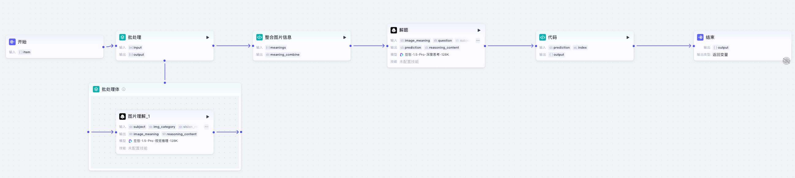
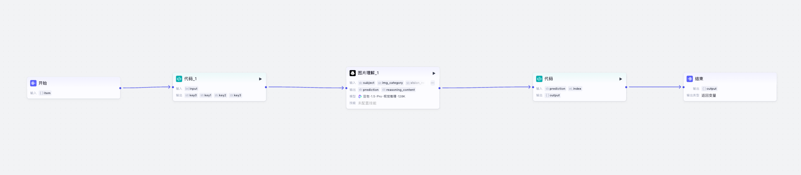
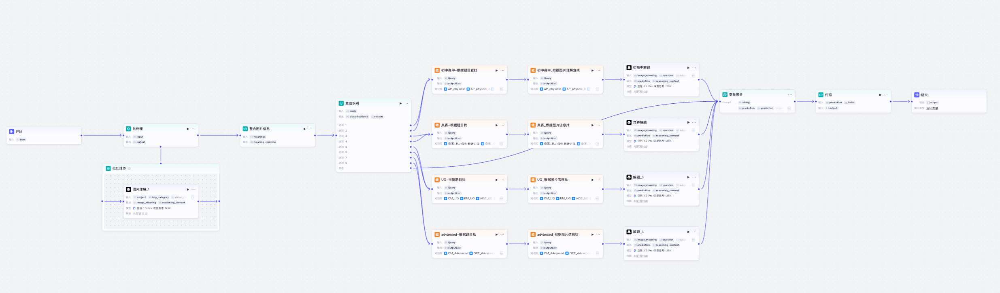
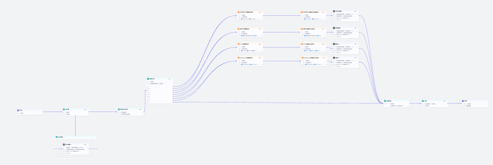
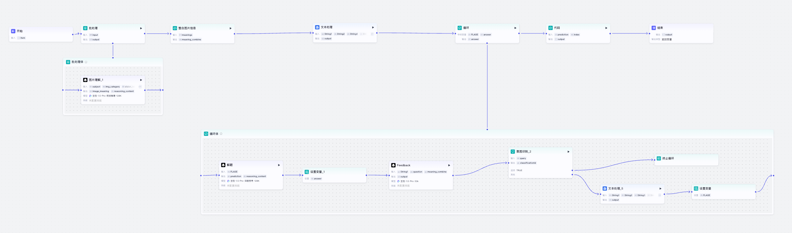
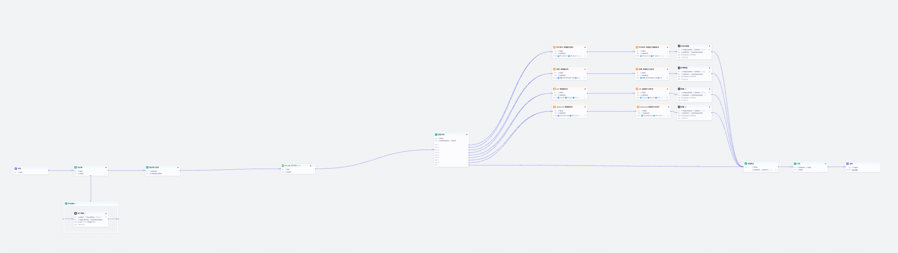

# Workflow Diagrams | 工作流图表

This directory contains workflow diagrams for different experimental configurations.

此目录包含不同实验配置的工作流图表。

## Workflow Overview | 工作流概览

Our physics problem-solving system consists of multiple workflow configurations, each testing different components and their combinations.

我们的物理问题求解系统包含多个工作流配置，每个配置测试不同的组件及其组合。

---

## Baseline Workflow | 基线工作流

**Configuration**: Baseline  
**配置**: 基线

**Description | 描述**:

This is the baseline workflow that serves as the foundation for all experimental variables. It supports batch processing of physics problems, taking multimodal inputs (text and diagrams) and generating solutions through a structured pipeline.

这是所有实验变量的基线工作流，作为所有实验的基础。它支持批量解物理题，接收多模态输入（文本和图表），通过结构化流程生成解答。

**Key Features | 关键特性**:
- Batch processing capability for multiple problems
  - 支持批量处理多个问题
- Multimodal input handling (text and images)
  - 多模态输入处理（文本和图像）
- Image understanding and integration
  - 图像理解和整合
- Problem-solving with reasoning
  - 带推理的问题求解
- Code execution for final output formatting
  - 代码执行以格式化最终输出

**Workflow Components | 工作流组件**:
1. **开始 (Start)**: Receives input items
   - **开始**: 接收输入项
2. **批处理 (Batch Processing)**: Processes multiple inputs
   - **批处理**: 处理多个输入
3. **整合图片信息 (Integrate Image Information)**: Combines image meanings
   - **整合图片信息**: 整合图像含义
4. **图片理解_1 (Image Understanding_1)**: Uses Doubao 1.5-Pro-Visual Reasoning model
   - **图片理解_1**: 使用豆包1.5-Pro视觉推理模型
5. **解题 (Problem Solving)**: Uses Doubao 1.5-Pro-Deep Thinking model
   - **解题**: 使用豆包1.5-Pro深度思考模型
6. **代码 (Code)**: Executes code for output formatting
   - **代码**: 执行代码以格式化输出
7. **结束 (End)**: Returns final output
   - **结束**: 返回最终输出

**Performance | 性能**:
- Accuracy: 35.0% (70/200 on development set)
- 准确率: 35.0%（开发集200题中70题正确）

**Access | 访问**:
- Coze Workflow Link: See [../resources/links.md](../resources/links.md)
- Coze工作流链接: 参见 [../resources/links.md](../resources/links.md)

---

## Model: Model_Only_MultiModal | 模型: 仅多模态模型

**Configuration**: Model_Only_MultiModal  
**配置**: 仅多模态模型

**Description | 描述**:

This workflow uses a unified multimodal model approach, where a single multimodal model (Model_Only_MultiModal) handles both diagram interpretation and reasoning tasks. Unlike the baseline which uses separate models for different stages, this configuration attempts to streamline the process by using one model for multiple purposes.

此工作流使用统一多模态模型方法，其中单一多模态模型（Model_Only_MultiModal）同时处理图表解释和推理任务。与基线使用不同模型处理不同阶段不同，此配置尝试通过使用一个模型处理多个任务来简化流程。

**Key Features | 关键特性**:
- Unified multimodal model for both image understanding and reasoning
  - 统一多模态模型同时处理图像理解和推理
- Simplified architecture compared to baseline
  - 相比基线更简化的架构
- Single model handles multiple tasks
  - 单一模型处理多个任务

**Performance | 性能**:
- Accuracy: 29.0% (58/200 on development set)
- 准确率: 29.0%（开发集200题中58题正确）
- **Note**: This configuration performed worse than baseline, indicating that specialized models for different tasks are more effective.
- **注意**: 此配置性能低于基线，表明针对不同任务的专门模型更有效。

---

## Model: Model_Deepseek-r1 | 模型: Deepseek-r1

**Configuration**: Model_Deepseek-r1  
**配置**: Deepseek-r1

**Description | 描述**:

This workflow replaces the baseline reasoning model with the more powerful Model_Deepseek-r1. This model is specifically designed for deep reasoning and complex problem-solving tasks. The architecture maintains the same structure as the baseline but uses this enhanced reasoning model in the problem-solving stage.

此工作流用更强大的Model_Deepseek-r1替换基线推理模型。该模型专门为深度推理和复杂问题求解任务设计。架构保持与基线相同的结构，但在问题求解阶段使用此增强推理模型。

**Key Features | 关键特性**:
- Enhanced reasoning model (Deepseek-r1) for problem-solving
  - 使用增强推理模型（Deepseek-r1）进行问题求解
- Maintains baseline architecture structure
  - 保持基线架构结构
- Improved reasoning capabilities
  - 改进的推理能力
- One of the most impactful individual improvements
  - 最具影响力的单项改进之一

**Performance | 性能**:
- Accuracy: 40.0% (80/200 on development set)
- 准确率: 40.0%（开发集200题中80题正确）
- **Improvement**: +5.0% over baseline (35.0%)
- **改进**: 相比基线（35.0%）提升5.0%

---

## Language: Chinese to English Translation | 语言: 中文翻译为英文

**Configuration**: Language_Chi_translate_to_Eng  
**配置**: 中文翻译为英文

**Description | 描述**:

This workflow adds a Chinese-to-English translation preprocessing step to standardize the input language. All Chinese inputs are first translated to English before being processed by the reasoning model. This approach helps standardize the input format and may improve model performance by ensuring consistent language processing.

此工作流添加中英文翻译预处理步骤以标准化输入语言。所有中文输入在由推理模型处理之前首先翻译为英文。这种方法有助于标准化输入格式，并可能通过确保一致的语言处理来提升模型性能。

**Key Features | 关键特性**:
- Chinese-to-English translation preprocessing
  - 中英文翻译预处理
- Language standardization before reasoning
  - 推理前的语言标准化
- Consistent input format
  - 一致的输入格式
- One of the most impactful individual improvements
  - 最具影响力的单项改进之一

**Performance | 性能**:
- Accuracy: 39.5% (79/200 on development set)
- 准确率: 39.5%（开发集200题中79题正确）
- **Improvement**: +4.5% over baseline (35.0%)
- **改进**: 相比基线（35.0%）提升4.5%

---

## RAG: Without 1800 Problems | RAG: 无1800题

**Configuration**: RAG_without1800  
**配置**: 无1800题RAG

**Description | 描述**:

This workflow integrates Retrieval-Augmented Generation (RAG) using only foundational textbook knowledge. The RAG system retrieves relevant physics concepts and principles from the textbook knowledge base to enhance the problem-solving process. This configuration tests the impact of basic knowledge retrieval without the additional solved problems database.

此工作流集成检索增强生成（RAG），仅使用基础教科书知识。RAG系统从教科书知识库中检索相关物理概念和原理，以增强问题求解过程。此配置测试基础知识检索的影响，不包含额外的已解决问题数据库。

**Key Features | 关键特性**:
- Retrieval-Augmented Generation with textbook knowledge only
  - 仅使用教科书知识的检索增强生成
- Retrieves foundational physics concepts
  - 检索基础物理概念
- Enhances reasoning with external knowledge
  - 用外部知识增强推理
- No solved problems database
  - 不包含已解决问题数据库

**Performance | 性能**:
- Accuracy: 37.5% (75/200 on development set)
- 准确率: 37.5%（开发集200题中75题正确）
- **Improvement**: +2.5% over baseline (35.0%)
- **改进**: 相比基线（35.0%）提升2.5%

---

## RAG: With 1800 Problems | RAG: 有1800题

**Configuration**: RAG_with1800  
**配置**: 有1800题RAG

**Description | 描述**:

This workflow enhances the RAG system by augmenting the textbook knowledge base with a database of 1,800 solved physics problems with detailed solutions. The system can retrieve both foundational concepts and similar solved problems, providing more comprehensive knowledge support for problem-solving. This configuration tests whether adding solved problems improves performance over textbook-only RAG.

此工作流通过用包含1800个已解决问题及详细解答的数据库增强教科书知识库来增强RAG系统。系统可以检索基础概念和相似的已解决问题，为问题求解提供更全面的知识支持。此配置测试添加已解决问题是否比仅使用教科书的RAG提升性能。

**Key Features | 关键特性**:
- Enhanced RAG with both textbook knowledge and solved problems
  - 增强RAG，包含教科书知识和已解决问题
- Database of 1,800 solved problems with detailed solutions
  - 包含1800个已解决问题及详细解答的数据库
- Retrieves similar problems and solutions
  - 检索相似问题和解答
- More comprehensive knowledge support
  - 更全面的知识支持

**Performance | 性能**:
- Accuracy: 38.0% (76/200 on development set)
- 准确率: 38.0%（开发集200题中76题正确）
- **Improvement**: +3.0% over baseline (35.0%)
- **改进**: 相比基线（35.0%）提升3.0%
- **Note**: Slightly better than RAG_without1800, confirming the value of solved problems database.
- **注意**: 略优于无1800题RAG，证实了已解决问题数据库的价值。

---

## Feedback: Feedback Loop | 反馈: 反馈循环

**Configuration**: Feedback_Use  
**配置**: 使用反馈

**Description | 描述**:

This workflow implements a self-correcting feedback loop mechanism. After generating an initial solution, the system evaluates the solution and can refine or correct it through iterative feedback. The feedback mechanism is designed to improve solution quality by allowing the system to self-validate and improve its outputs.

此工作流实现自我纠正反馈循环机制。在生成初始解答后，系统评估解答并可以通过迭代反馈来改进或纠正。反馈机制旨在通过允许系统自我验证和改进其输出来提升解答质量。

**Key Features | 关键特性**:
- Self-correcting feedback loop
  - 自我纠正反馈循环
- Solution validation and refinement
  - 解答验证和改进
- Iterative improvement mechanism
  - 迭代改进机制
- Self-validation capability
  - 自我验证能力

**Performance | 性能**:
- Accuracy: 35.0% (70/200 on development set)
- 准确率: 35.0%（开发集200题中70题正确）
- **Note**: This configuration matched baseline performance, indicating that the initial feedback mechanism did not yield improvements in this iteration. Further refinement of the feedback mechanism may be needed.
- **注意**: 此配置与基线性能相同，表明初始反馈机制在此次迭代中未产生改进。可能需要进一步改进反馈机制。

---

## Integrated Method | 集成方法

**Configuration**: Integrated Method  
**配置**: 集成方法

**Description | 描述**:

This is the final integrated workflow that combines all the effective components identified in the ablation study. It integrates the powerful Model_Deepseek-r1 for reasoning, Chinese-to-English translation preprocessing, and enhanced RAG with the 1800 solved problems database. This configuration demonstrates the superiority of a holistic approach over single enhancements, achieving the best performance among all configurations.

这是最终的集成工作流，结合了消融研究中识别的所有有效组件。它集成了强大的Model_Deepseek-r1进行推理、中英文翻译预处理，以及包含1800个已解决问题数据库的增强RAG。此配置证明了整体方法优于单一增强，在所有配置中达到最佳性能。

**Key Features | 关键特性**:
- Combines all effective components
  - 结合所有有效组件
- Model_Deepseek-r1 for enhanced reasoning
  - 使用Model_Deepseek-r1进行增强推理
- Chinese-to-English translation preprocessing
  - 中英文翻译预处理
- Enhanced RAG with 1800 solved problems
  - 包含1800个已解决问题的增强RAG
- Strategic component integration
  - 策略性组件集成
- Demonstrates component synergy
  - 展示组件协同效应

**Performance | 性能**:
- Accuracy: 45.0% (90/200 on development set)
- 准确率: 45.0%（开发集200题中90题正确）
- **Improvement**: +10.0% over baseline (35.0%)
- **改进**: 相比基线（35.0%）提升10.0%
- **Best Performance**: Highest accuracy among all configurations
- **最佳性能**: 所有配置中最高的准确率
- **Key Insight**: Successfully corrected 35 problems that baseline failed, demonstrating the power of integrated approach
- **关键洞察**: 成功纠正了基线失败的35个问题，证明了集成方法的力量

---

## How to Add New Workflow Images | 如何添加新工作流图片

1. **Save the workflow screenshot** as PNG format
   - **保存工作流截图**为PNG格式
   - Naming convention: `{configuration_name}_workflow.png`
   - 命名规范: `{配置名称}_workflow.png`

2. **Place the image** in the `images/` directory
   - **将图片**放入 `images/` 目录

3. **Update this document** with:
   - **更新本文档**，包含:
   - Image reference: ``
   - Configuration name and description
   - 配置名称和描述
   - Performance metrics
   - 性能指标
   - Access links (if available)
   - 访问链接（如果有）

4. **Update the main README** if needed
   - **更新主README**（如需要）

---

**Note**: All workflow images should be clear and readable, showing the complete workflow structure and node connections.

**注意**: 所有工作流图片应该清晰可读，显示完整的工作流结构和节点连接。

